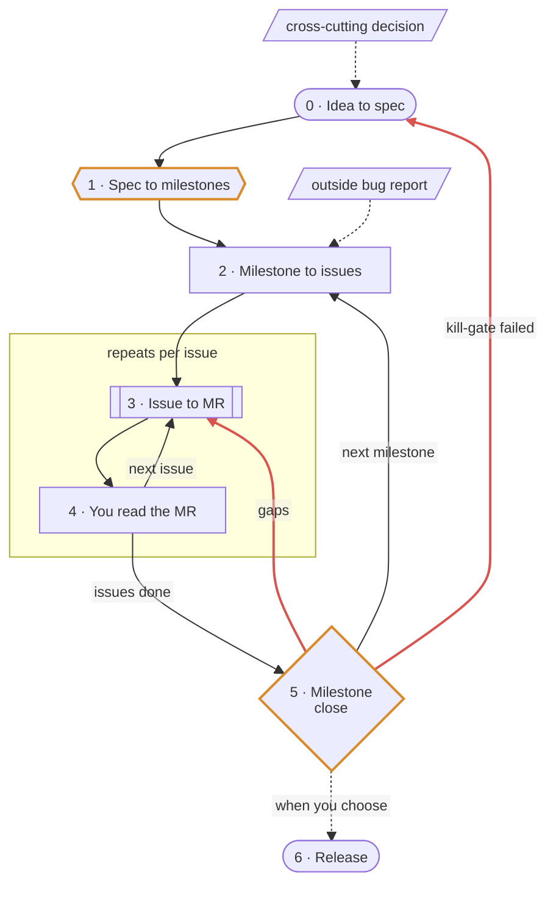

# Dream team workflow

Amber: exit gates. Red: loop-backs from a failed gate. Dotted: side entries and the
user-triggered release.

## Walkthrough

### 0. Idea to spec (once per project)

- You: "I want a Rust rewrite of a DNS resolver for large public deployments."
- Agent: `brainstorming` asks one question at a time (scale, what is out of scope, how parity is
  proven), then writes a lean v1 spec on a topic branch. `jit-context` injects the lean-ADR
  template on the spec write; `branch-guard` keeps design docs off `master`.
- You: read the spec, push back until it matches your model, merge it.
- Result: `docs/specs/<date>-<project>-v1-design.md`, about 160 lines.

A spec is only for decisions wider than one issue: the v1 design, a cross-cutting change. Work
that fits one issue gets no spec; a decision made during it goes into the issue description.

### 1. Spec to milestones

- You: "Cut milestones from the spec."
- Agent: `cut-milestones` drafts milestones with one exit gate each (design review, build test, or
  field evidence), plus the dependency order. The first milestone is the cheapest proof the approach
  works: M1 kill-gates, "within 5% of the reference resolver's QPS or redesign".
- You: set the numbers (14 days, SERVFAIL ≤1%, val corpus >99%). The agent leaves them as
  placeholders; they are product decisions.
- Result: tracker milestones with the exit criterion in each description, a ROADMAP table, and a
  note naming which milestones run in parallel and what waits on what.

A stable project's minor release skips the spec: "plan 1.3 around #140". `cut-milestones` drafts
one version milestone, exit "release criteria met and #140 closed", and a `## Release criteria`
section in ROADMAP the first time. Backlog issues join it as they are filed.

### 2. Milestone to issues

- You: "File the issues for M4."
- Agent: writes each issue with `scope-issue` (context, problem, proposal), sets `type::`,
  `area::` and the milestone. When a proposal would need a guess, it files a `Scout:` issue
  (`type::scout`) with questions and a time box instead, e.g. one for the canary rollback
  baseline. An issue that cannot start before another closes ends with a `Blocked by #<n>` line.
  A milestone gated on field evidence gets one `Evidence:` issue: what to deploy and where, the
  start date, and how to collect the measurement. `body-cap` bounces an issue that runs too long.
  Work spanning milestones, or waiting on features not built yet, gets one `Meta:` issue
  (`type::meta`, no milestone): a checklist of child issues, plus plain lines naming the feature
  a piece waits on. A child is filed only when its work can start.
- You: skim the titles; fix anything missing now.

A bug reported from outside (the dogfood router, a user) enters here too: one issue per
`scope-issue`, in the milestone it belongs to.

A change you describe in chat enters here when it is issue-sized: it needs a decision from you,
contradicts the spec, adds a component, or needs a lab check. The agent gives its assessment and
offers to file the issue instead of editing; open questions go in the issue. Smaller changes it
makes inline.

### 3. Issue to MR (the daily loop)

- You: "what's next in M4?" The agent lists the milestone's open issues without an open
  blocker and proposes one.
- You: "work on #126."
- Agent: `dream-team:dream-fixer`:
  1. Reads the issue and the project `CLAUDE.md`. Given a `Meta:` issue, it picks an open
     child with no open blocker and works that.
  2. Triage: an open decision gets a dialog with 2–3 options and their costs. The answer is
     written into the issue description. A `Blocked by` line naming an open issue stops here.
  3. Tier:
     - Scout: research within the time box, a note in `docs/research/`, follow-up issues, an MR
       for the note that closes the scout issue.
     - Light (docs, comments, help text, config, rename, or a small bug fix the agent reproduced
       first): the agent makes the edit inline, runs `gateCommands`, and dispatches one reviewer
       — `gdoc-writer` for docs, the domain reviewer type otherwise. Full criteria: dream-fixer
       step 2a.
     - Full: implementer, mechanical gate, over-engineering cuts, quality reviewers, domain
       reviewer, bounded fix rounds.
  4. Lab work (perf gate, tests that need root) through `dream-team:lab-runner` on the host the
     repo's `CLAUDE.md` names.
  5. MR: one folded commit, description by `scope-mr`, with ratchet floors, the diagram and any
     component table updated in the same MR. ROADMAP status waits for `milestone-close`.
  6. Adjacent defects found on the way are filed as issues, never left in the MR text.
- You: check the roster line, any assumptions at the top of the report, and the MR.

### 4. You read the MR

- The MR's why and root cause are written for you; this is where you learn the system.
- A fact about how the system works: say "note X" and the agent adds it to the contributor doc
  (`docs/development.md`). What you don't flag, `milestone-close` proposes later.
- An agent mistake: correct it; the agent adds one line to the untracked `CLAUDE.local.md`. You
  promote lines to the tracked `CLAUDE.md`.
- You: merge, or comment and hand it back.

Steps 3 and 4 repeat per issue. Bugs found on the way become issues in the right milestone.

### 5. Milestone close

- You: "is M4 done?"
- Agent: `milestone-close`:
  1. Checks the exit criterion against evidence (14 days in the field, SERVFAIL ratio from
     `/metrics`), reading the `Evidence:` issue for a field gate. Not met: proposes one issue per
     gap, files the ones you keep, and stops. A failed kill-gate proposes no issues: the redesign
     goes back to step 0.
  2. Triage table of open issues: close, move, or blocks-close. You answer in one reply.
     `Meta:` issues stay out of the table; the agent ticks their closed children.
  3. Docs check: the diagram and any component table against the code, specs that need a
     `Superseded by` line, ROADMAP status for the milestone's merged work, facts from its merged
     MRs that `docs/development.md` lacks, `CLAUDE.md` and `CLAUDE.local.md` lines to cut (with
     the lab host or tool change that would fix the gotcha, where one could), and
     `CLAUDE.local.md` lines to promote to `CLAUDE.md`. Each fact, cut and promotion is one
     proposed line for you to keep or drop.
  4. Applies what you approved: moves, one docs MR, milestone closed, ROADMAP updated. A
     pre-1.0 project that opts in through `CLAUDE.md` gets a `v0.<n>.0` tag on the close.
- You: the gap issues, the triage table, the proposed facts and the cuts are your decisions.

### 6. Release

- You: "tag v0.1."
- Agent: writes the first CHANGELOG section (empty until then); `changelog-cap` keeps entries
  to one sentence. CI builds the release.

## Where your time goes

| Step | Your decision |
|---|---|
| 0 | Approve the spec |
| 1 | Exit criteria and their numbers |
| 2 | Is anything missing from the issue list |
| 3 | Which issue is next; triage dialogs, only when a decision is open |
| 4 | Read the MR, note what you learned, merge |
| 5 | Gap issues to file; close or move per leftover issue; each proposed fact and cut |
